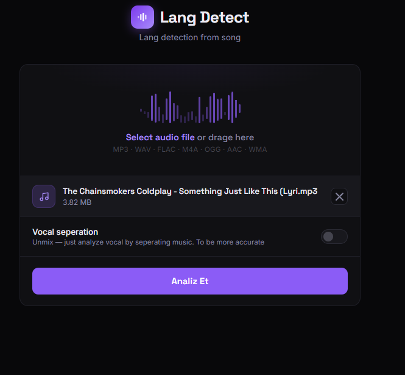
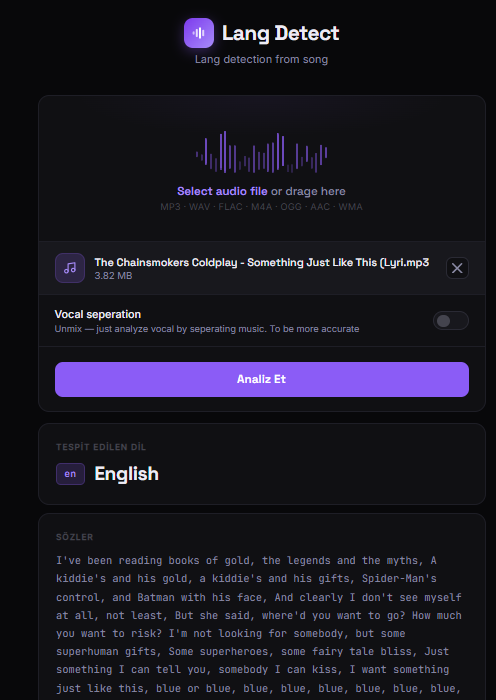
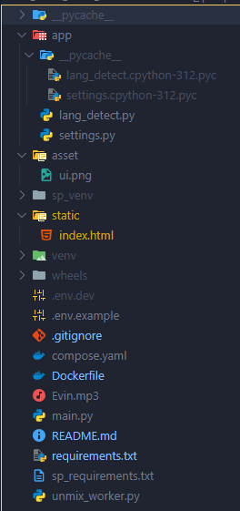

# Audio Language Detector

A production-ready REST microservice that accepts an audio file, optionally separates vocals using **Open-Unmix**, and detects the spoken/sung language using **OpenAI Whisper** — all packaged in a clean Docker setup with isolated Python environments for conflicting dependency trees.

--

## Demo

<!-- SCREENSHOT 1: Place a screenshot of the Swagger UI at docs/swagger_ui.png -->
<!-- Recommended: open http://localhost:8000/docs after running, take a full-page screenshot -->


<!-- SCREENSHOT 2: Place a screenshot of a /detect API response (JSON) at docs/detect_response.png -->
<!-- Recommended: use the Swagger UI "Try it out" button, upload an audio file, capture the response panel -->


---

## Features

- **File Upload API** — `POST /detect` accepts mp3, wav, flac, m4a, ogg, aac, wma, mp4, webm
- **Vocal Separation** — optional pre-processing via [Open-Unmix](https://github.com/sigsep/open-unmix-pytorch) (`umxhq` model) before language detection; improves accuracy on music with heavy background instrumentation
- **Language Detection** — powered by [OpenAI Whisper](https://github.com/openai/whisper); `tiny` model in dev mode, `turbo` in production
- **Isolated Dependency Trees** — Whisper requires `torch 2.8`, Open-Unmix requires `torch 2.3` + `torchaudio`; solved with a dedicated Python virtualenv per component, orchestrated via `subprocess`
- **Multi-stage Docker build** — build artifacts separated from runtime image; `--copies` flag on venv ensures binary portability across stages
- **Model caching** — Docker volumes persist Whisper and Open-Unmix model weights across container restarts
- **Health endpoint** — `GET /health` for container orchestration and uptime monitoring
- **Auto-cleanup** — each request gets an isolated temp directory; cleaned up in a `finally` block regardless of outcome

---

## Architecture

```
Client
  │
  │  POST /detect  (multipart/form-data)
  ▼
FastAPI  (main.py)
  │
  ├── [ENABLE_UNMIX=true]
  │       │
  │       └── subprocess → /worker_venv/bin/python unmix_worker.py
  │                              │
  │                              └── Open-Unmix (torch 2.3.1)
  │                                  → vocals.wav
  │
  └── Whisper detect_lang(audio_path)
          │
          └── {"detected_language": "ru", "unmix_applied": true, ...}
```

Two separate Python environments share the same container:

| Environment | Runtime | Key Packages |
|---|---|---|
| System Python | `python main.py` | FastAPI, Whisper, torch 2.8.0 |
| `/worker_venv` | `subprocess` call | Open-Unmix, torchaudio, torch 2.3.1 |

---

## Tech Stack

| Layer | Technology |
|---|---|
| API Framework | FastAPI 0.116 + Uvicorn |
| Language Detection | OpenAI Whisper (`openai-whisper`) |
| Vocal Separation | Open-Unmix (`openunmix`) |
| Deep Learning | PyTorch 2.8 (main) / PyTorch 2.3 (worker) |
| Containerization | Docker — multi-stage build |
| Orchestration | Docker Compose |
| Config Management | `python-dotenv`, environment variables |

---

## Quick Start

**Prerequisites:** Docker, Docker Compose

```bash
git clone https://github.com/nurgelli/Song_lang_detector.git
cd audio-language-detector

docker compose up --build
```

> First build takes 10–20 minutes (two PyTorch installations). First request downloads the Whisper model (~75 MB in dev mode).

The API is available at **http://localhost:8000**  
Interactive docs (Swagger UI) at **http://localhost:8000/docs**

---

## API

### `POST /detect`

Detect the language of an audio file.

**Request**
```
Content-Type: multipart/form-data
Body: file=<audio_file>
```

**Response**
```json
{
  "filename": "song.mp3",
  "detected_language": "tr",
  "unmix_applied": false,
  "job_id": "c3f2a1b0-..."
}
```

**Supported formats:** `.mp3` `.wav` `.flac` `.m4a` `.ogg` `.aac` `.wma` `.mp4` `.webm`

**cURL example**
```bash
curl -X POST http://localhost:8000/detect \
  -F "file=@/path/to/song.mp3"
```

### `GET /health`
```json
{"status": "ok", "unmix_applied": false}
```
---


> http:localhost:8000




> Result


---

## Configuration

All configuration is managed via `.env.dev`:

| Variable | Default | Description |
|---|---|---|
| `ENV_MODE` | `dev` | `dev` → tiny Whisper model; `prod` → turbo model |
| `ENABLE_UNMIX` | `false` | Enable vocal separation before language detection |
| `PYTHON_SP_VENV_PATH` | `/worker_venv/bin/python` | Path to the Open-Unmix venv Python binary |
| `UNMIX_WORKER_SCRIPT` | `/app/unmix_worker.py` | Path to the vocal separation worker |
| `TEMP_DIR` | `/tmp/song_processing` | Working directory for temporary files |

**Enable vocal separation at runtime (no rebuild needed):**

```bash
# Edit .env.dev
ENABLE_UNMIX=true

docker compose restart
```

---

## Project Structure



---

## Design Decisions

**Why two PyTorch versions in one container?**  
Open-Unmix's `torchaudio` dependency pins `torch==2.3.x`, while the latest Whisper benefits from `torch==2.8`. Installing both in the same environment causes silent import errors or version conflicts. The solution is a dedicated venv (`/worker_venv`) built with `python -m venv --copies` — the `--copies` flag produces a portable binary rather than symlinks, which is essential for Docker multi-stage `COPY` to work correctly.

**Why subprocess instead of in-process import?**  
Importing both torch versions in the same Python process is not possible. Subprocess isolation is the standard pattern for this class of dependency conflict, and it has the added benefit that a crash in the worker does not affect the API server.

**Why FastAPI over Flask?**  
Native async support, automatic OpenAPI/Swagger generation, and built-in multipart file handling via `python-multipart` — all with zero boilerplate.

---

## Roadmap

- [ ] Batch endpoint — detect language for multiple files in one request
- [ ] Language confidence score in response
- [ ] Prometheus metrics endpoint (`/metrics`)
- [ ] GPU support (`CUDA_VISIBLE_DEVICES` passthrough in compose)
- [ ] Unit tests with `pytest` + mock audio fixtures

---

> NOTE: BECAUSE OF TINY (MIN WHISPER MODEL) THERE IS PROBLEM WITH ACCURACY IN DETECTION LANGUAGE, THAT WHEY RECOMMENDED TO APPLY UNMIX TO SEPERATE VOCAL!


---

## License

MIT
